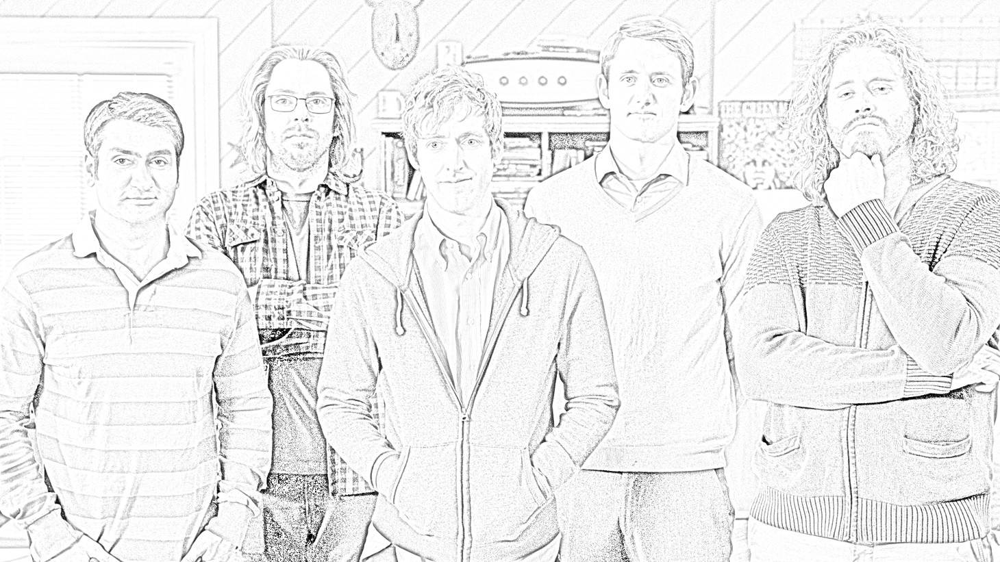
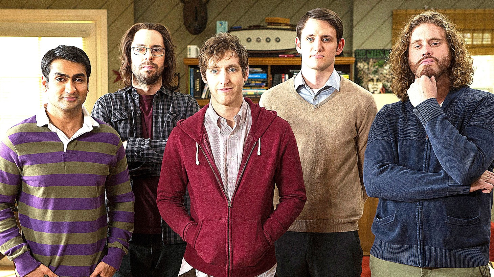

# Image Enhancer


Image Enhancer can perform gray-scale effect, pencil sketch effect, sharp effect, sepia effect, summer effect, winter effect, invert effect and also can alter Image's contrast, brightness and blurriness. It was created using python's numpy, openCV, pillow, scipy and streamlit packages.

## Installation
Open command prompt and create new environment
```
conda create -n your_env_name python=3.10.8
```
Then Activate the newly created environment
```
conda activate your_env_name
```
Clone the repository using `git`
```
git clone https://github.com/Prakashdeveloper03/Image-Enhancer.git
```
Change to the cloned directory
```
cd <directory_name>
```
Then install all requirement packages for the app
```
pip install -r requirements.txt
```
Then, Run the `app.py` script
```
streamlit run app.py
```

## 📷 Screenshots

### Original Image:


### Brightness:


### Blurring:


### Contrast:


### Background Remover:


### Gray-Scale Effect:


### Pencil Drawing Effect:


### Sepia Effect:


### Sharp Effect:


### Invert Effect:


### Summer Effect:


### Winter Effect:

